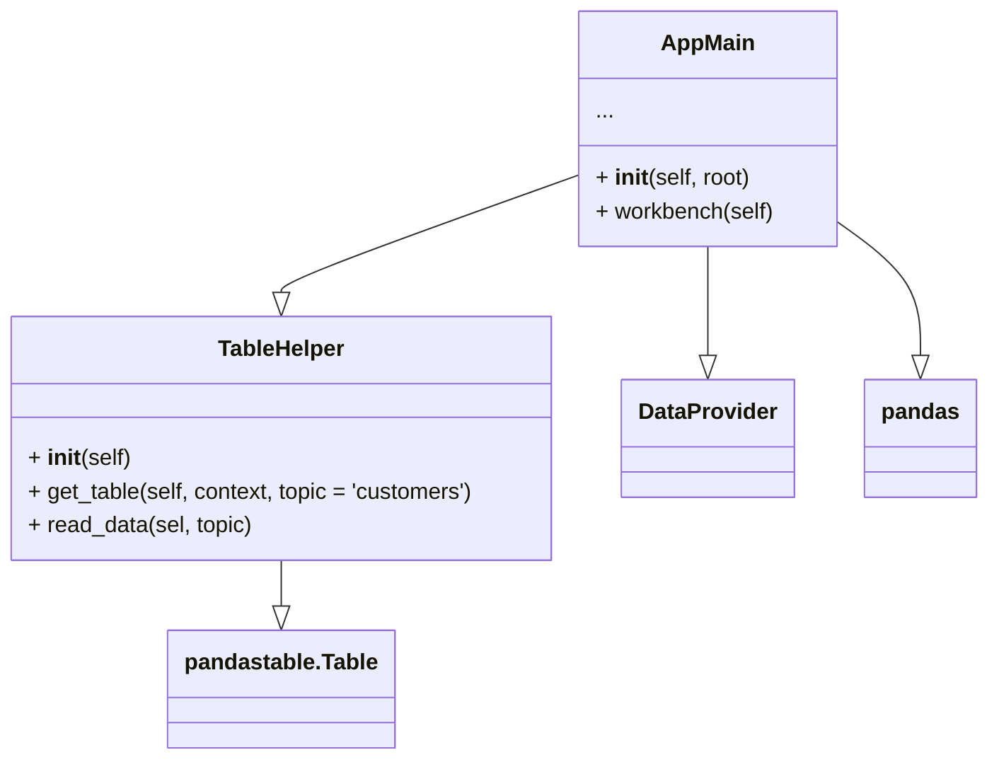

## Klassendiagramm 

```mermaid
classDiagram

 
    
    

    class AppMain{
        + __init__(self, root)
        ...
        + workbench(self)
   }

    

   class TableHelper{
    + __init__(self)
    + get_table(self, context, topic = 'customers')
    + read_data(sel, topic)
   }

    

    

    AppMain  --|> DataProvider

    AppMain  --|> pandas
    AppMain--|> TableHelper
    TableHelper --|> pandastable.Table


```