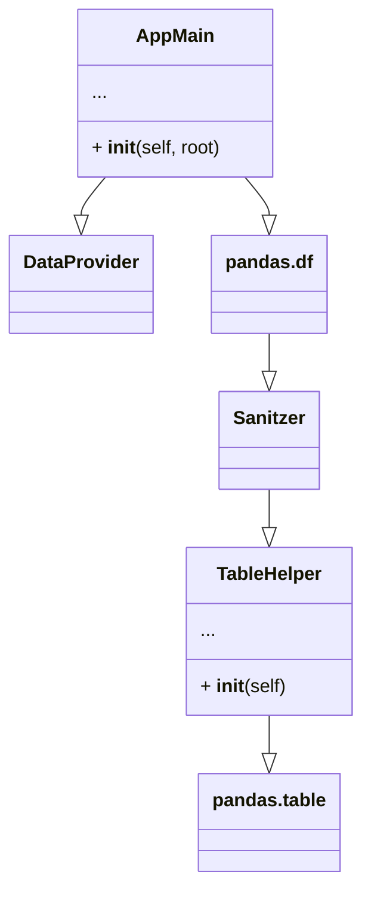

## Klassendiagramm 

```mermaid
classDiagram

 
    
    

    class AppMain{
        + __init__(self, root)
        ...
        
   }

    

   class TableHelper{
    + __init__(self)
    ...
   }

    

    

    AppMain  --|> DataProvider

    AppMain  --|> pandas.df
    pandas.df --|> Sanitzer
    Sanitzer --|> TableHelper
    TableHelper --|> pandas.table


```