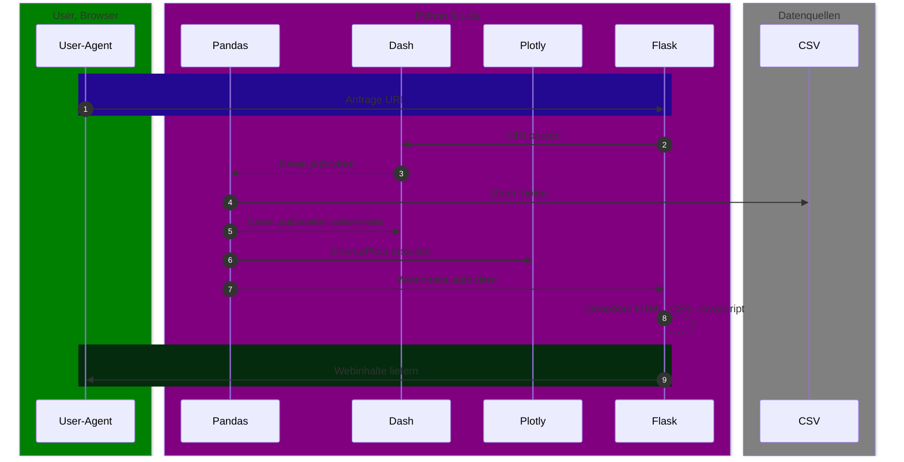

## Multi-Tier Modell Dash

```mermaid
sequenceDiagram
autonumber
    
    box Green User, Browser
    participant User-Agent
    end

    box Purple Python & Libs
    participant Pandas
    participant Dash
    participant Plotly
    participant Flask
    end

    box gray Datenquellen
    participant CSV
    end
    rect rgba(35, 8, 146, 1)
        User-Agent->>Flask: Anfrage URI
    end
    Flask->>Dash: URI parsen
    Dash->>Pandas: Daten anfordern
    Pandas ->> CSV: Daten holen
    Pandas ->> Dash: Daten aufbereitet weiterleiten
    Pandas ->> Plotly: Charts/Plots erstellen
    Pandas ->> Flask: Webinhalte anfordern 
    Flask --> Flask: Generiere HTML, CSS, Javascript
    rect rgba(4, 43, 14, 1)
    Flask->>User-Agent: Webinhalte liefern
    
    end

   
   
```
