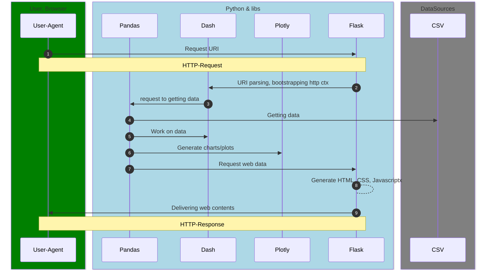

## Multi-Tier Modell Dash

```mermaid
sequenceDiagram
autonumber
    
    box Green User, Browser
    participant User-Agent
    end

    box lightblue Python & libs
    participant Pandas
    participant Dash
    participant Plotly
    participant Flask
    end

    box gray DataSources
    participant CSV
    end
    
    User-Agent->>Flask: Request URI
    Note over User-Agent, Flask: HTTP-Request
    
    Flask->>Dash: URI parsing, bootstrapping http ctx
    Dash->>Pandas: request to getting data
    Pandas ->> CSV: Getting data
    Pandas ->> Dash: Work on data
    Pandas ->> Plotly: Generate charts/plots
    Pandas ->> Flask: Request web data
    Flask --> Flask: Generate HTML, CSS, Javascriptx
    
    Flask->>User-Agent: Delivering web contents
    Note over User-Agent, Flask: HTTP-Response
    

   
   
```
