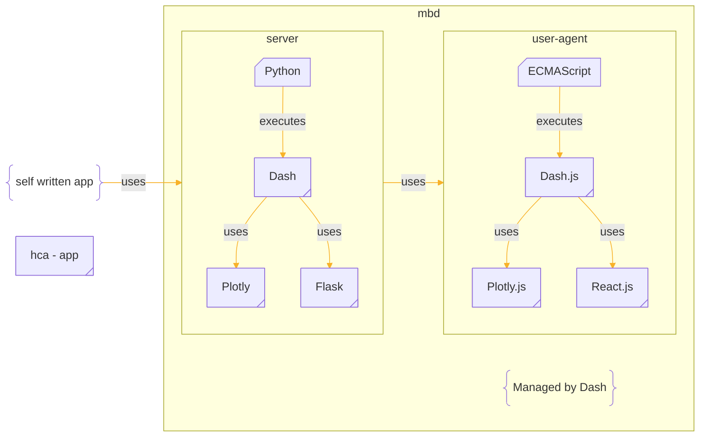

```mermaid
---
config:
  look: default
  theme: handDrawn
  themeVariables:
    primaryColor: '#BB2528'
    primaryTextColor: '#fff'
    primaryBorderColor: '#7C0000'
    lineColor: '#F8B229'
    secondaryColor: '#006100'
    tertiaryColor: '#fff'
---
flowchart LR
    app_hca@{ shape: braces, label: "self written app"}
   
    A@{ shape: card, label: "Python"}
    B@{ shape: tag-rect, label: "Dash"}
    C@{ shape: tag-rect, label: "Plotly"}
    D@{ shape: tag-rect, label: "Flask"}
    E@{ shape: braces, label: "Managed by Dash"}
    
    F@{ shape: tag-rect, label: "hca - app"}
    
    F
    app_hca-- uses -->server--  uses -->user-agent
   subgraph mbd
      E
      

      subgraph server
        A-- executes -->B
        B-- uses -->C
        B-- uses -->D
        
      end

      
      js@{ shape: card, label: "ECMAScript"}
      d_js@{ shape: tag-rect, label: "Dash.js"}
      p_js@{ shape: tag-rect, label: "Plotly.js"}
      r_js@{ shape: tag-rect, label: "React.js"}

      subgraph user-agent
        js-- executes -->d_js
        d_js-- uses -->p_js
        d_js-- uses -->r_js
       
      end
  end
    
   
    

```