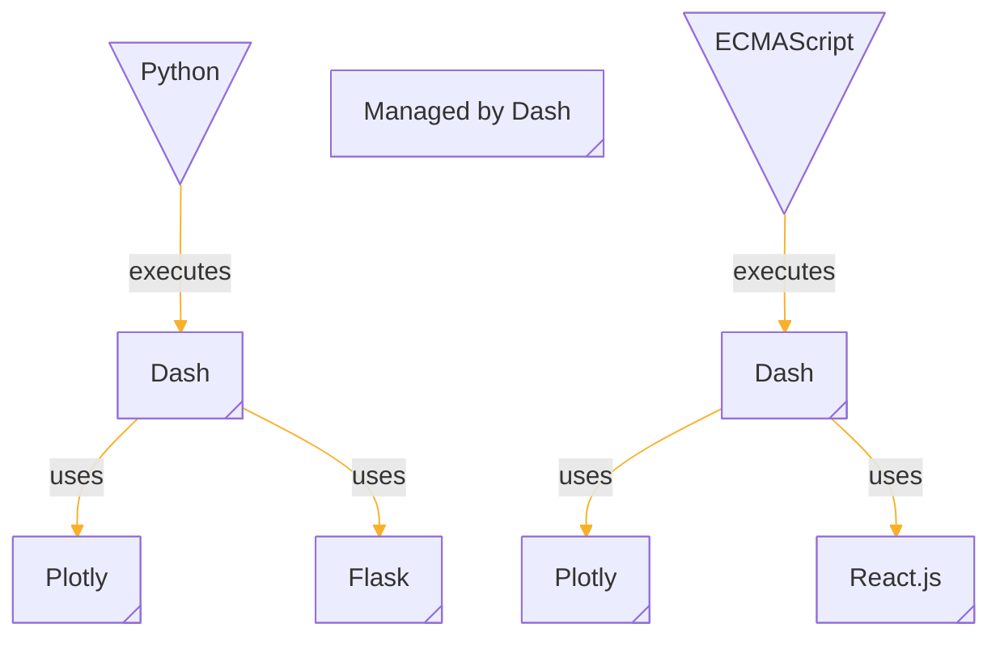

```mermaid
---
config:
  look: default
  theme: handDrawn
  themeVariables:
    primaryColor: '#BB2528'
    primaryTextColor: '#fff'
    primaryBorderColor: '#7C0000'
    lineColor: '#F8B229'
    secondaryColor: '#006100'
    tertiaryColor: '#fff'
---
flowchart TD
    A@{ shape: manual-file, label: "Python"}
    B@{ shape: tag-rect, label: "Dash"}
    C@{ shape: tag-rect, label: "Plotly"}
    D@{ shape: tag-rect, label: "Flask"}
    E@{ shape: tag-rect, label: "Managed by Dash"}


    A-- executes -->B
    B-- uses -->C
    B-- uses -->D


    js@{ shape: manual-file, label: "ECMAScript"}
    d_js@{ shape: tag-rect, label: "Dash"}
    p_js@{ shape: tag-rect, label: "Plotly"}
    r_js@{ shape: tag-rect, label: "React.js"}

    js-- executes -->d_js
    d_js-- uses -->p_js
    d_js-- uses -->r_js


```