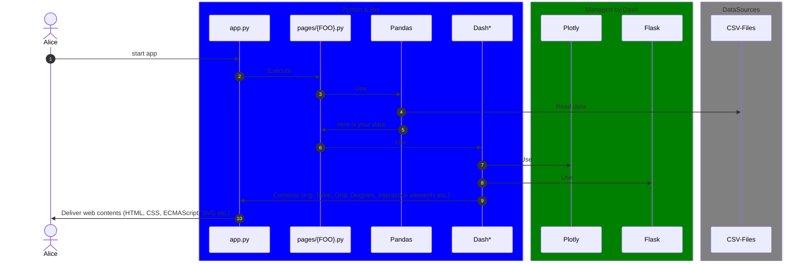

## Python modules and their relations

```mermaid
sequenceDiagram
autonumber
    
    actor Alice

    box blue Python & libs
    participant app.py
    participant pages/{FOO}.py
    participant Pandas
    participant Dash*
    end

    box green Managed by Dash
    
    participant Plotly
    participant Flask
    end

    box gray DataSources
    participant CSV-Files
    end
    
    Alice->>app.py: start app

    app.py->>pages/{FOO}.py: Execute
    pages/{FOO}.py->>Pandas: Use
    
    Pandas->>CSV-Files: Read data
    activate Pandas
    Pandas->>pages/{FOO}.py: here is your data
    
    pages/{FOO}.py->>Dash*: Use
    Dash*->>Plotly: Use
    Dash*->>Flask: Use

    Dash*->>app.py: Contents (e.g: Table, Grid, Diagram, interactice elements etc.)
    app.py->>Alice: Deliver web contents (HTML, CSS, ECMAScript, SVG etc.)
    
```
