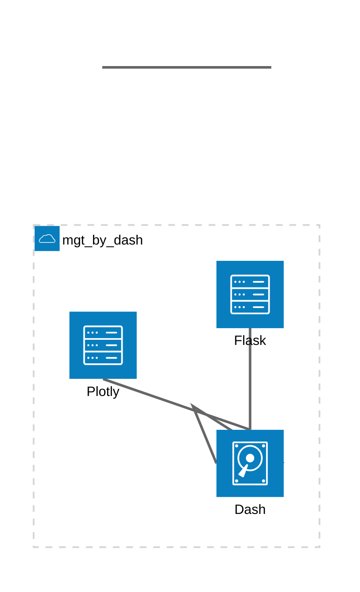

```mermaid
---
config:
  look: handDrawn
  theme: neutral
---
architecture-beta
    group mgt_by_dash(cloud)[mgt_by_dash]

    service dash(disk)[Dash] in mgt_by_dash
    service px(server)[Plotly] in mgt_by_dash
    service flask(server)[Flask] in mgt_by_dash
    junction junctionCenter
    junction junctionRight

    junctionCenter:R -- L:junctionRight
    dash:L -- R:dash
    dash:T -- B:px
    dash:T -- B:flask

```